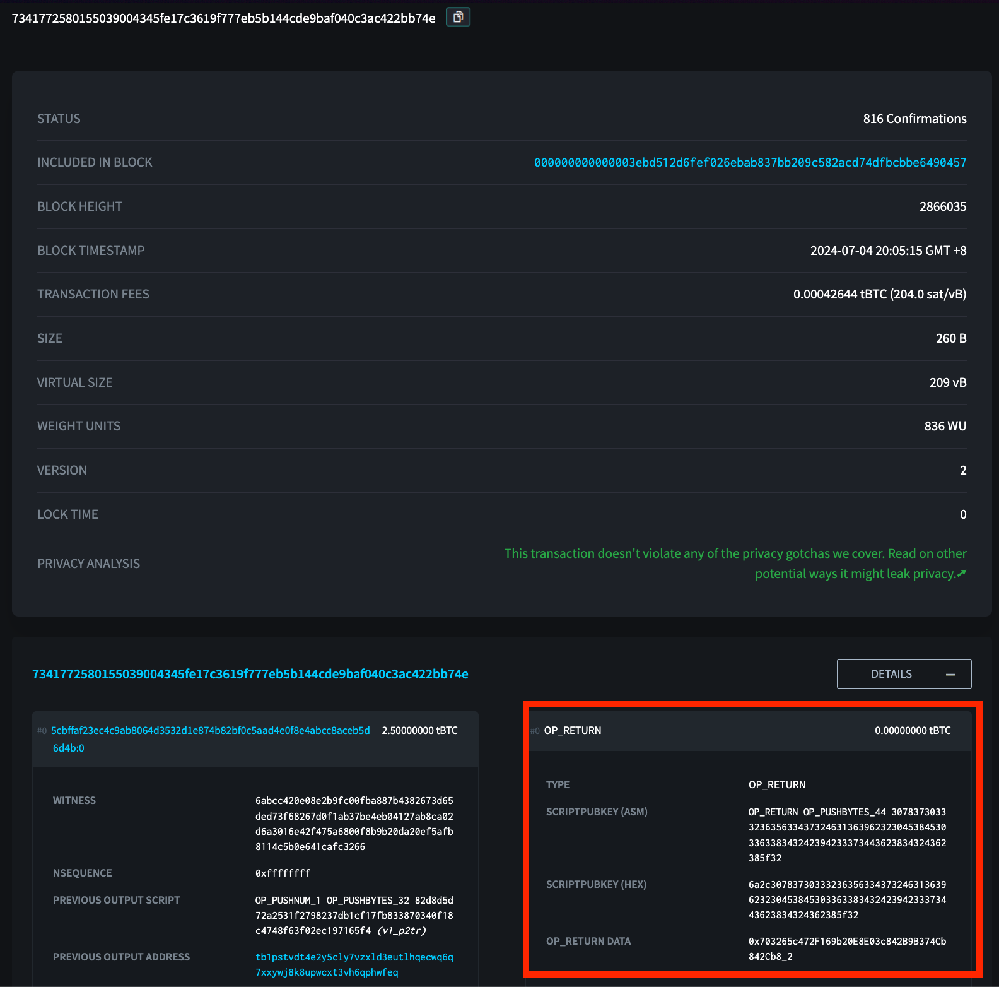

:::info
The following section details Sygma's compatibility with Bitcoin and its constituent layer-2's. 
:::

# Introduction To Bitcoin Support

The Sygma protocol extends its support to Bitcoin and its associated layer-2 networks. A notable characteristic of chains built on EVM and Substrate is their capability to generate event logs from transactions and contract interactions. These event logs are particularly useful for tracking onchain interactions *externally*, and therefore are essential to Sygma's relayer network. The relayer network listens for these events, interprets the logs, parses the messages within them, verifies the authenticity of these computations, and posts them to the destination chains. However, Bitcoin and other UTXO-based chains generally do not produce event logs, as they do not have a concept of "state" in the same way stateful chains do.

To get around this limitation, Sygma configures its MPC relayers to monitor specific deposit addresses on Bitcoin. When a transaction, or UTXO in Bitcoin-terms, is made to these deposit addresses, the protocol treats it similarly to an event on EVM. During the transaction where this deposit occurs, relayers look for an additional UTXO called `OP_RETURN`, which encodes 80-bytes of arbitrary information (i.e. metadata) within the transaction. This is how the relayer network obtains details of the cross-chain transaction including EVM addresses and other metadata.

## How Does Sygma Handle Bitcoin Cross-Chain?

Sygma facilitates the transfer of Bitcoin to Ethereum by setting up specific Bitcoin deposit addresses and employing a series of event listeners and handlers to monitor, process, and relay transactions. This process involves several steps to ensure secure and accurate cross-chain communication. The following sections detail the technical components and workflow involved in this process, illustrating how Bitcoin transactions are detected, processed, and converted into equivalent assets on the Ethereum blockchain.

1. Configuration: 
    - Deposit addresses are specified in [`config.go`](https://github.com/sygmaprotocol/sygma-relayer/blob/main/chains/btc/config/config.go) under the `Resources` field.

2. Listening and Detection: 
    - `BtcListener` in [`listener.go`](https://github.com/sygmaprotocol/sygma-relayer/blob/main/chains/btc/listener/listener.go) scans Bitcoin blocks for transactions to these addresses.
    - `DecodeDepositEvent` in [`util.go`](https://github.com/sygmaprotocol/sygma-relayer/blob/main/chains/btc/listener/util.go) processes transactions and extracts metadata from `OP_RETURN`.
     
3. Handling Deposits:
    - `BtcDepositHandler` in [`deposit-handler.go`](https://github.com/sygmaprotocol/sygma-relayer/blob/main/chains/btc/listener/deposit-handler.go) processes detected deposits and creates cross-chain messages.
    - The message includes the recipient's Ethereum address and other details.

4. Event Handling:
    - `FungibleTransferEventHandler` in [`event-handlers.go`](https://github.com/sygmaprotocol/sygma-relayer/blob/main/chains/btc/listener/event-handlers.go) fetches events and processes deposits, sending messages to Ethereum.

5. Message Handling:
    - `BtcMessageHandler` in [`message-handler.go`](https://github.com/sygmaprotocol/sygma-relayer/blob/main/chains/btc/executor/message-handler.go) processes cross-chain messages and converts them into proposals.

6. Execution:
    - `Executor` in [`executor.go`](https://github.com/sygmaprotocol/sygma-relayer/blob/main/chains/btc/executor/executor.go) signs and sends transactions.
    - Constructs and sends the raw transaction to the Bitcoin network.
    - Upon confirmation, the equivalent amount of wrapped BTC is minted on Ethereum.

## An Example

For an example of a cross-chain transaction on Bitcoin using the Sygma protocol, see [this transaction hash](https://blockstream.info/testnet/tx/7341772580155039004345fe17c3619f777eb5b144cde9baf040c3ac422bb74e).

**Anatomy**:
- Output Index 0: `OP_RETURN`
  - Desc: Includes `OP_RETURN` data containing the metadata (`0x703265c472F169b20E8E03c842B9B374Cb842Cb8_2`). The metadata indicates the address the funds should be bridged to as well as the domain ID (`2`), which represents Ethereum Sepolia.
- Output Index 1: UTXO #1
  - Desc: Contains 0.01000000 tBTC, which is the fixed fee amount for bridging with the Sygma protocol.
  - Output Address: [tb1p0r2w3ugreaggd7nakw2wd04up6rl8k0cce8eetxwmhnrelgqx87s4zdkd7](https://blockstream.info/testnet/address/tb1p0r2w3ugreaggd7nakw2wd04up6rl8k0cce8eetxwmhnrelgqx87s4zdkd7)
- Output Index 2: UTXO #2 
  - Desc: Contains 2.48957356 tBTC, representing the amount of BTC being bridged to the EVM. 
  - Output Address: [tb1p72xwajwdxdfhmu5dp39sh8jdc6msnez0a7rq4gk5jeep0kvccnsqkgcj7e](https://blockstream.info/testnet/address/tb1p72xwajwdxdfhmu5dp39sh8jdc6msnez0a7rq4gk5jeep0kvccnsqkgcj7e)

